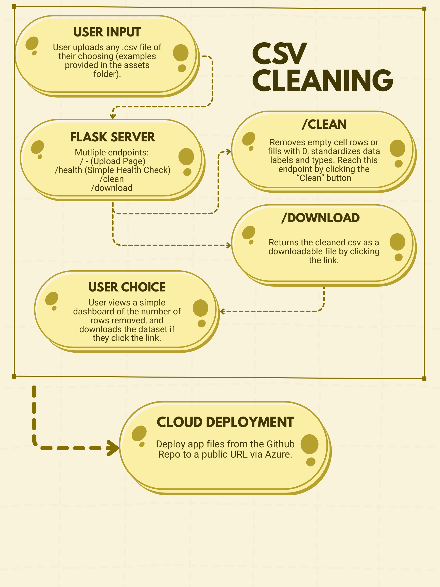

# Cleaning_Project

### Executive Summary
I got this idea from the first case study we did, and from all of the other data science classes I have taken that require data cleaning and manipulation. The problem that I aim to solve with this project is dealing with messy datasets, containing missing values and non-uniform data types. This tool is meant for anyone analyzing data looking to optimize their cleaning process. Overall, the webapp that I have built will consume a csv file, clean it, and return a new cleaned csv file and a summary of how many rows were removed. The cleaning process that I employ with this app is simple, it either removes or fills missing data points. It also standardizes names and values of the dataset, as well as data types within rows.

### System Overview
To complete this project, I used the data cleaning concepts from the first case study about NYC 311 service requests. I worked in my computer's terminal, Cursor, Docker, Azure, and pushed and pulled data from my Github Repository. The datasets I have provided as examples for cleaning were pulled from Kaggle, or some of the smaller ones (grocery.csv and example.csv) I made on my own in an Excel file. I have laid out the structure of my app in the linked architecture diagram (), which is also linked in the assets file.
